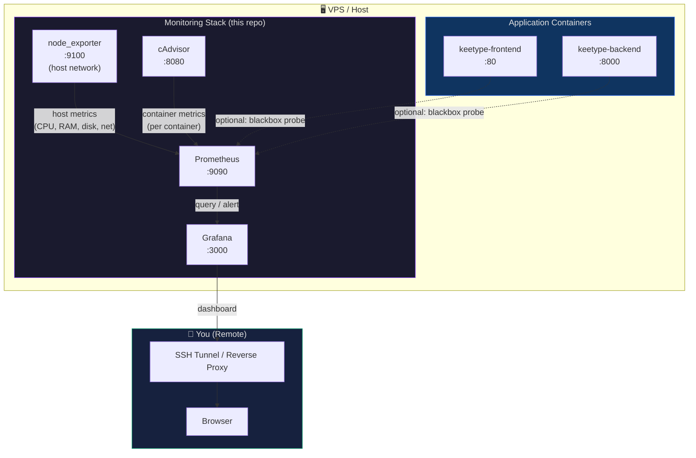

# 🔭 promegrava-monitor

> **Production-grade monitoring stack for a Docker-based VPS**
> Prometheus · Grafana · cAdvisor · node_exporter

[](https://prometheus.io)
[](LICENSE)
[](https://github.com/keefalegends)

This project stands up a full observability stack alongside existing Docker workloads — **without touching or restarting them**. It is designed as a DevOps portfolio project and as a reusable template for any Linux VPS running Docker Compose.

---

## 📐 Architecture



### Component responsibilities

| Component | Role | Port |
|-----------|------|------|
| **node_exporter** | Scrapes VPS host metrics (CPU, RAM, disk, network) | `9100` |
| **cAdvisor** | Per-container resource metrics | `8080` |
| **Prometheus** | Scrapes exporters, stores time-series data, evaluates alert rules | `9090` |
| **Grafana** | Queries Prometheus and renders dashboards | `3000` |
| **Alertmanager** *(planned)* | Routes alert notifications (email, Slack, PagerDuty) | `9093` |

---

## 📁 Project structure

```
promegrava-monitor/
├── docker-compose.yml              ← full monitoring stack
├── .env.example                    ← secrets template (copy → .env)
├── .gitignore
│
├── prometheus/
│   ├── prometheus.yml              ← scrape & rule configuration
│   └── rules/
│       └── host_alerts.yml         ← CPU / RAM / disk alert rules (template)
│
├── grafana/
│   └── provisioning/
│       ├── datasources/
│       │   └── prometheus.yml      ← auto-registers Prometheus on first boot
│       └── dashboards/
│           └── dashboards.yml      ← auto-imports dashboard JSON files
│
├── docs/
│   └── ...                         ← screenshots, runbooks (see below)
│
└── README.md
```

---

## 🚀 Quick start

### Prerequisites

- VPS running Linux with Docker ≥ 24 and Docker Compose v2
- Existing containers (`keetype-frontend`, `keetype-backend`) already running

### 1 — Clone the repo

```bash
git clone https://github.com/keefalegends/promegrava-monitor.git
cd promegrava-monitor
```

### 2 — Configure secrets

```bash
cp .env.example .env
nano .env   # set a strong GRAFANA_ADMIN_PASSWORD
```

### 3 — Verify Docker bridge gateway IP

node_exporter runs in host-network mode. Prometheus reaches it via the Docker bridge gateway:

```bash
docker network inspect bridge | grep Gateway
# typical output: "Gateway": "172.17.0.1"
```

If your gateway differs from `172.17.0.1`, update `prometheus/prometheus.yml`:

```yaml
# job_name: node_exporter
static_configs:
  - targets: ["<your-gateway-ip>:9100"]
```

### 4 — Start the stack

```bash
docker compose up -d
```

Check everything came up:

```bash
docker compose ps
```

### 5 — Connect to Grafana safely

> [!WARNING]
> Prometheus (`:9090`) and Grafana (`:3000`) are bound to **127.0.0.1** only.
> They are **NOT** reachable from the public internet — this is intentional.
> Do **not** open these ports in your firewall or VPS security group.

**Recommended access method — SSH tunnel:**

```bash
# On your local machine:
ssh -L 3000:127.0.0.1:3000 -L 9090:127.0.0.1:9090 user@your-vps-ip -N
```

Then open `http://localhost:3000` in your browser.
Login with the credentials from your `.env` file.

**Alternative — Nginx reverse proxy with HTTP Basic Auth or OAuth2:**
See [`docs/nginx-reverse-proxy.md`](docs/nginx-reverse-proxy.md) *(coming soon)*.

### 6 — Import dashboards

After login, import these community dashboards from [grafana.com/dashboards](https://grafana.com/grafana/dashboards/):

| Dashboard | ID | What it shows |
|-----------|----|----------------|
| Node Exporter Full | `1860` | Full host metrics |
| Docker Container & Host Metrics | `179` | Per-container CPU/RAM/net |
| cAdvisor Exporter | `14282` | cAdvisor-native view |

*Import: Dashboards → New → Import → paste the ID → Load → Select "Prometheus" data source → Import*

---

## 📸 Dashboard screenshots

> Screenshots will be added once the stack is deployed on the production VPS.

| Dashboard | Preview |
|-----------|---------|
| Host Overview (node_exporter) | *(coming soon)* |
| Container Metrics (cAdvisor) | *(coming soon)* |
| Prometheus Self-monitoring | *(coming soon)* |

---

## 🔔 Alerting (optional / planned)

Pre-written alert rule stubs are in [`prometheus/rules/host_alerts.yml`](prometheus/rules/host_alerts.yml).

Thresholds included (commented out, ready to enable):
- CPU > 85% for 5 min → `warning`
- RAM > 90% for 5 min → `critical`
- Disk < 15% free for 10 min → `warning`

To add **Alertmanager** with Slack/email notifications, uncomment the `alerting` block in `prometheus/prometheus.yml` and add an `alertmanager` service to `docker-compose.yml`.

---

## 🛠️ Useful commands

```bash
# Tail all monitoring logs
docker compose logs -f

# Reload Prometheus config without restart (hot-reload)
curl -X POST http://localhost:9090/-/reload

# Check Prometheus targets health
curl -s http://localhost:9090/api/v1/targets | python3 -m json.tool

# Stop the stack (data is preserved in named volumes)
docker compose down

# Full reset including volumes — ⚠️ deletes all stored metrics
docker compose down -v
```

---

## 🔒 Security notes

| Surface | Status | Notes |
|---------|--------|-------|
| Prometheus web UI | 🟡 Internal only | Bound to `127.0.0.1` — access via SSH tunnel |
| Grafana web UI | 🟡 Internal only | Bound to `127.0.0.1` — access via SSH tunnel |
| cAdvisor web UI | 🟡 Internal only | Bound to `127.0.0.1` |
| node_exporter metrics | 🟡 Host-network | Not exposed externally if firewall blocks `:9100` |
| Grafana admin password | ⚠️ Must change | Set via `.env`, never commit `.env` to git |
| Grafana sign-up | 🟢 Disabled | `GF_USERS_ALLOW_SIGN_UP=false` |

> [!CAUTION]
> If you choose to expose Grafana publicly (e.g., behind Nginx), you **must**:
> 1. Use a strong admin password
> 2. Enable HTTPS (Let's Encrypt / Certbot)
> 3. Consider adding OAuth2 (Google/GitHub SSO) or HTTP Basic Auth at the proxy level

---

## 🗺️ Roadmap

- [x] Core stack: Prometheus + Grafana + cAdvisor + node_exporter
- [x] Auto-provisioned Prometheus data source
- [x] Alert rule stubs (CPU, RAM, disk)
- [ ] Alertmanager with Slack integration
- [ ] Nginx reverse proxy guide with TLS
- [ ] Blackbox exporter for HTTP endpoint probing
- [ ] Grafana dashboard JSON exports committed to repo
- [ ] GitHub Actions workflow for config linting

---

## 📝 License

MIT — see [LICENSE](LICENSE).

---

*Built as a DevOps portfolio project by [@keefalegends](https://github.com/keefalegends)*
